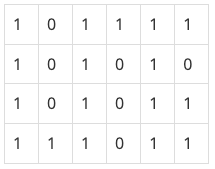

# BOJ

## 그리디 2178 미로 탐색
[문제로 이동!](https://www.acmicpc.net/problem/2178)

## 문제

N×M크기의 배열로 표현되는 미로가 있다.

미로에서 1은 이동할 수 있는 칸을 나타내고, 0은 이동할 수 없는 칸을 나타낸다. 이러한 미로가 주어졌을 때, (1, 1)에서 출발하여 (N, M)의 위치로 이동할 때 지나야 하는 최소의 칸 수를 구하는 프로그램을 작성하시오. 한 칸에서 다른 칸으로 이동할 때, 서로 인접한 칸으로만 이동할 수 있다.

위의 예에서는 15칸을 지나야 (N, M)의 위치로 이동할 수 있다. 칸을 셀 때에는 시작 위치와 도착 위치도 포함한다.

## 입력

첫째 줄에 두 정수 N, M(2 ≤ N, M ≤ 100)이 주어진다. 다음 N개의 줄에는 M개의 정수로 미로가 주어진다. 각각의 수들은 붙어서 입력으로 주어진다.

## 예제 입력



    """
    case 1:
    입력
    4 6
    101111
    101010
    101011
    111011
    출력
    15

    case 2:
    입력
    2 25
    1011101110111011101110111
    1110111011101110111011101
    출력
    38
    """


## 풀이
> bfs로 접근을한다. (0,0) 시작 위치에서 상,하,좌,우를 탐색해서 1이라면 시작 위치의 값을 더해준다. 이를 반복하면 시작위치에서 5 떨어져 잇는 곳은 5가 저장되어있다.
> 모든 그래프를 이 방식으로 새로 그려주면 마지막 도착위치인 (n-1,m-1)위치에 시작 위치로 부터의 거리가 저장되어 있다. 

### solution
1. 해당 문제에서는 visited 리스트를 사용하지 않는다.
2. bfs 함수 인자로 시작 위치 x, y 좌표를 보내준다.
3. 현재 위치에서 상,하,좌,우를 탐색할 수 있는 dx, dy 리스트를 정의해준다.(for문으로 현재 x와 y에 계산해줄 것임)
4. queue에 현재 위치 set 형식으로 삽입하고 while문을 돈다.
5. queue에서 현재 위치 x, y를 꺼내주고 상,하,좌,우를 탐색한다.
6. 탐색시 범위를 벗어나면 continue 해준다.
7. 상,하,좌,우 에서 1을 만나면 현재 위치의 값을 더해주고 해당 값을 큐에 삽입해준다.

## 코드



    from collections import deque
    
    
    def bfs(x, y, graph):
    
        dx = [0, 0, 1, -1]
        dy = [1, -1, 0, 0]
    
        queue = deque()
        queue.append((x,y))
        while queue:
            x, y = queue.popleft()
            for i in range(4):
                nx = x + dx[i]
                ny = y + dy[i]
                if nx<0 or nx>=n or ny<0 or ny>=m:
                    continue
                elif graph[nx][ny] == 1:
                    graph[nx][ny] += graph[x][y]
                    queue.append((nx,ny))
    
    
    if __name__ == "__main__":
        n, m = map(int, input().split())
        graph = []
        for _ in range(n):
            graph.append(list(map(int,input())))
    
        bfs(0,0, graph)
        print(graph[n-1][m-1])
