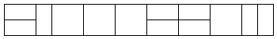

# BOJ

## DP 11727 2xN 타일링 2
[문제로 이동!](https://www.acmicpc.net/problem/11727)

## 문제

2×n 직사각형을 1×2, 2×1과 2×2 타일로 채우는 방법의 수를 구하는 프로그램을 작성하시오.

아래 그림은 2×17 직사각형을 채운 한가지 예이다.

## 입력

첫째 줄에 n이 주어진다. (1 ≤ n ≤ 1,000)

## 출력

첫째 줄에 2×n 크기의 직사각형을 채우는 방법의 수를 10,007로 나눈 나머지를 출력한다.

## 예제 입력


    """
    case 1:
    입력
    2 
    출력
    3

    case 2:
    입력
    8 
    출력
    171
    """


## 풀이

DP 문제로 해당 문제의 규칙을 찾고 점화식을 세운 뒤 해당 점화식으로 코드를 작성하면 된다. 우선 규칙을 찾기 위해 약간의 노가다를 해보면 다음과 같은 규칙을 찾게 된다.

규칙 :

1 -> 1개 
2 -> 3개 
3 -> 5개 
4 -> 11개(3*2 + 5) 
5 -> 21개(5+2 + 11) 

점화식 : f(n) = f(n-1) + f(n-2) * 2

## 코드



    def solution(n):
        dp = [0] * (n+1)
        if n >= 1:
            dp[1] = 1
        if n >= 2:
            dp[2] = 3
        if n >= 3:
            dp[3] = 5
        if n > 3:
            for i in range(4,n+1):
                dp[i] = (dp[i-1] + (dp[i-2] * 2)) % 10007
        return dp[n]
    
    if __name__ == "__main__":
        n = int(input())
        print(solution(n))
