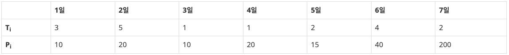

# BOJ

## DP 14501 퇴사
[문제로 이동!](https://www.acmicpc.net/problem/14501)

## 문제

상담원으로 일하고 있는 백준이는 퇴사를 하려고 한다.

오늘부터 N+1일째 되는 날 퇴사를 하기 위해서, 남은 N일 동안 최대한 많은 상담을 하려고 한다.

백준이는 비서에게 최대한 많은 상담을 잡으라고 부탁을 했고, 비서는 하루에 하나씩 서로 다른 사람의 상담을 잡아놓았다.

각각의 상담은 상담을 완료하는데 걸리는 기간 Ti와 상담을 했을 때 받을 수 있는 금액 Pi로 이루어져 있다.

N = 7인 경우에 다음과 같은 상담 일정표를 보자.

1일에 잡혀있는 상담은 총 3일이 걸리며, 상담했을 때 받을 수 있는 금액은 10이다. 5일에 잡혀있는 상담은 총 2일이 걸리며, 받을 수 있는 금액은 15이다.

상담을 하는데 필요한 기간은 1일보다 클 수 있기 때문에, 모든 상담을 할 수는 없다. 예를 들어서 1일에 상담을 하게 되면, 2일, 3일에 있는 상담은 할 수 없게 된다. 2일에 있는 상담을 하게 되면, 3, 4, 5, 6일에 잡혀있는 상담은 할 수 없다.

또한, N+1일째에는 회사에 없기 때문에, 6, 7일에 있는 상담을 할 수 없다.

퇴사 전에 할 수 있는 상담의 최대 이익은 1일, 4일, 5일에 있는 상담을 하는 것이며, 이때의 이익은 10+20+15=45이다.

상담을 적절히 했을 때, 백준이가 얻을 수 있는 최대 수익을 구하는 프로그램을 작성하시오.

## 입력

첫째 줄에 N (1 ≤ N ≤ 15)이 주어진다.

둘째 줄부터 N개의 줄에 Ti와 Pi가 공백으로 구분되어서 주어지며, 1일부터 N일까지 순서대로 주어진다. (1 ≤ Ti ≤ 5, 1 ≤ Pi ≤ 1,000)

## 예제 입력


    """
    case 1:
    입력
    7
    3 10
    5 20
    1 10
    1 20
    2 15
    4 40
    2 200
    출력
    45

    case 2:
    입력
    10
    5 50
    4 40
    3 30
    2 20
    1 10
    1 10
    2 20
    3 30
    4 40
    5 50
    출력
    90
    """


## 풀이

백트래킹을 이용해서 가능 경우의 수 중 최대값을 구해서 문제를 해결하였다. 하지만 DP를 사용하서 해결하면 더 간단하게 해결할 수 있다.

DP는 보텀업 방식으로 문제를 해결한다. DP 테이블을 n+1개를 0으로 초기화한다. array를 n-1 부터 0까지 순회하면서 DP 테이블을 업데이트할 것이다.

우선 상담일수가 array의 크기보다 벗어나면, 해당 상담을 진행할 수 없기 때문에 dp[i] 를 dp[i+1] 로 정의해준다.
상담이 가능하다면, `이전 상담일까지의 수익`과 `현재 상담일의 수익 + 현재 상담일을 끝내고 난 뒤의 상담일의 수익`을 비교해서 max값을 저장해준다.
현재 상담일을 끝내고 걸리는 시간 뒤의 상담일의 수익이 미리 계산되어 있어야 하기 때문에 반복문 순회를 n에서 0 순서로 진행한다.

## 코드



    # solution1: 백트래킹

    import sys
    sys.setrecursionlimit(10**6)
    
    
    def dfs(depth):
        global sum_max
    
        if depth == n:
            sum_max = max(sum(answer),sum_max)
            answer.pop()
            return
        elif depth > n:
            answer.pop()
            sum_max = max(sum(answer),sum_max)
            return
        else:
            for i in range(depth, n):
                answer.append(array[i][1])
                dfs(i+array[i][0])
    
        if len(answer) > 0:
            answer.pop()
        return
    
    
    if __name__ == "__main__":
        n = int(input())
        array = [tuple(map(int,input().split())) for _ in range(n)]
        sum_max = 0
        for i in range(n):
            answer = []
            dfs(i)
        print(sum_max)

    # solution2: DP

    def solution(array, n):
        dp = [0] * (n+1)
        for i in range(n-1, -1, -1):
            if i+array[i][0] > n:
                dp[i] = dp[i+1]
            else:
                left = dp[i+1]
                right = dp[i+array[i][0]]+array[i][1]
                dp[i] = max(left, right)
        return dp[0]
    
    
    if __name__ == "__main__":
        n = int(input())
        array = [tuple(map(int, input().split())) for _ in range(n)]
        print(solution(array, n))
